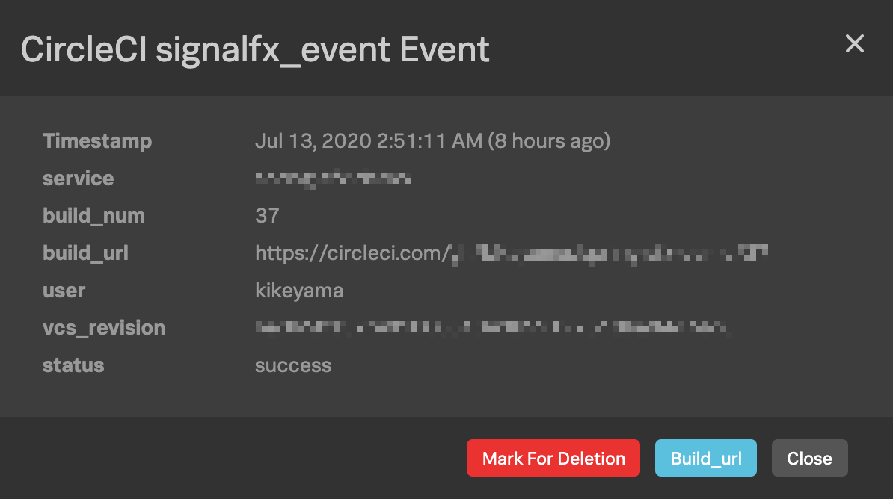

# CircleCI Orb: send custom event to SignalFx

Send custom event in `workflows` or `jobs` to SignalFx  

## Event in SignalFx



## Usage

This orb is available in both `workflows` and `jobs`.  

### workflow-event:

```
version: 2.1
description: Send workflow event to SignalFx
orbs:
  signalfx: kikeyama/signalfx@x.y.z
workflows:
  main:
    jobs:
      - signalfx/workflow-event:
          name: signalfx_event
          signalfx_access_token: ${SIGNALFX_ACCESS_TOKEN}
          signalfx_realm: ${SIGNALFX_REALM}
          service: service_name
          event_type: deploy
```

### job-event

```
version: 2.1
description: Send job event to SignalFx
jobs:
  build:
    docker:
      - image: <docker image>
    steps:
      - signalfx/job-event:
          name: signalfx_job_event
          signalfx_access_token: ${SIGNALFX_ACCESS_TOKEN}
          signalfx_realm: ${SIGNALFX_REALM}
          service: service_name
          event_type: build my app
orbs:
  signalfx: kikeyama/signalfx@x.y.z
```

### 

## Environment variables

Env var | Description
------- | -----------
`SIGNALFX_ACCESS_TOKEN` | Your organization access token  
`SIGNALFX_REALM` | Your realm (us0, us1, etc)

## Reference

[SignalFx Data Ingest API Reference](https://developers.signalfx.com/ingest_data_reference.html#tag/Send-Custom-Events)  
[Orb Authoring Process](https://circleci.com/docs/2.0/orb-author/)
